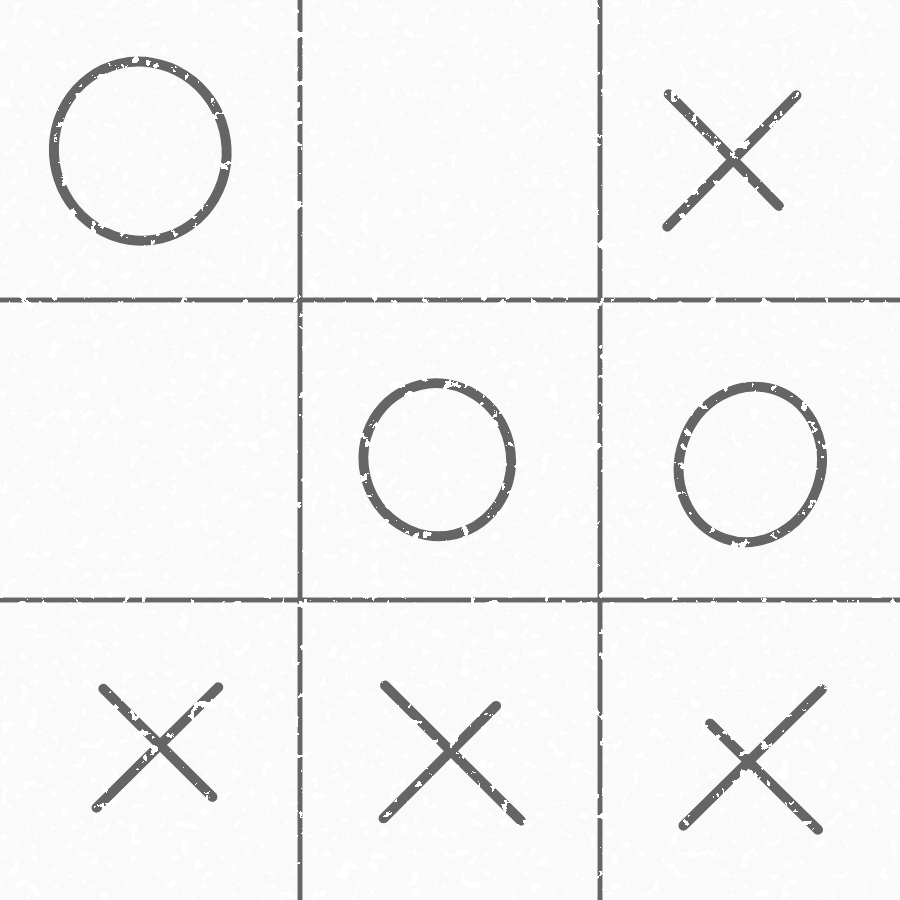

# Real-life tic-tac-toe

This is my entry for the [second Stack Overflow challenge](https://stackoverflow.com/beta/challenges/79651567/79664104).

---

Many assume tic-tac-toe has < 3**9 board states. But have they ever played a single game with friends and family?

> \[...] very limited possible states (like tic-tac-toe) \[...]

"very limited possible states"? Challenge accepted.



```python
#!/usr/bin/env python3
import decode
...
```

Read more on [Stack Overflow](https://stackoverflow.com/beta/challenges/79651567/79664104).
