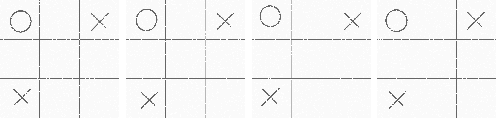

# Real-life tic-tac-toe

Many assume tic-tac-toe has < 3**9 board states. But have they ever played a single game with friends and family?

> \[...] very limited possible states (like tic-tac-toe) \[...]

"very limited possible states"? Challenge accepted.


On pencil and paper, board states are infinite, which floating-point approximates. With people cryptoanalysing other answers' X's and O's, I won't store any info there at all.

Then where'll I encode the secret message? A beginner might use X,Y coords like `x=0.AAABBBCCCDDD, y=0.EEEFFFGGGHHH`. The problem is patterns there'll arouse suspicion; concealment thereof's called steganography: it's a secret that the message even exists. Everything'll be normally distributed like fine hand movements randomly varying on paper. To ease drawing, we also want translational and scale invariance.

Note that the emphasis is on the text-to–board game *encoding* technique, not the *encryption*. "There are so many ciphers out there", so I just used "a simple shift cipher".



### Decoding

Think about which properties of the X's and O's fit the invariances and distributions above. Decode by just taking their ratios and differences. Take a photo of the ciphertext and trace it over with Inkscape at 900x900px (OpenCV could automate this but AI was discouraged), then run this:

```python
#!/usr/bin/env python3
#%pip install scipy

from dataclasses import dataclass
from math import floor, ldexp, pi
from numpy import frombuffer, sqrt, uint8
from numpy.linalg import norm as l2_norm
import re
from scipy.stats import lognorm, norm, rv_continuous
from sys import stdin
from typing import ClassVar, Iterable

plaintext_length: int = 8 # 8 letters
# plaintext_length = int(input("How long is the message? "))
CHARSET="utf-8"

class Cell:
    plaintext_bits: ClassVar[int]

    def decode(self, bit_scale: int) -> bytes:
        raise NotImplementedError

    def encode(self, idx: int, plaintext: bytes, results: list[str]) -> None:
        raise NotImplementedError

def unsample_uniform(bit_scale: int, normalizeds: Iterable[float]) -> bytes:
    return b"".join(floor(ldexp(x, bit_scale * 8)).to_bytes(bit_scale) for x in normalizeds)

TWO_RECIPROCAL_PI: float = 2 / pi
MY_LOGNORM: rv_continuous = lognorm(.1, 0)
@dataclass
class Ellipse(Cell):
    plaintext_bits = 2
    rotation: float
    y_scale: float

    def decode(self, bit_scale: int) -> bytes:
        normalized_rotation: float = abs(self.rotation) * TWO_RECIPROCAL_PI
        normalized_y_scale: float = float(MY_LOGNORM.cdf(self.y_scale)) * 2
        assert normalized_rotation < 1 and normalized_y_scale < 1
        return unsample_uniform(bit_scale, (normalized_rotation, normalized_y_scale))

DIAMETER_TEMPLATE: int = 160
DIAMETER_TEMPLATE_RECIPROCAL: float = 1 / DIAMETER_TEMPLATE
MY_NORMAL: rv_continuous = norm(0, 10)
@dataclass
class Cross(Cell):
    plaintext_bits = 3
    rightward_length: float
    rightward_x_mean: float
    rightward_y_mean: float
    leftward_length: float
    leftward_x_mean: float
    leftward_y_mean: float
    second_line_present: bool

    def decode(self, bit_scale: int) -> bytes:
        leftward_length_scale_normalized: float = float(MY_LOGNORM.cdf(sqrt(self.leftward_length / self.rightward_length)))
        leftward_length_ratio: float = self.leftward_length * DIAMETER_TEMPLATE_RECIPROCAL
        rightward_length_ratio: float = self.rightward_length * DIAMETER_TEMPLATE_RECIPROCAL
        delta_scale: float = 2 / (leftward_length_ratio + rightward_length_ratio)
        delta_x_normalized: float = float(MY_NORMAL.cdf((self.leftward_x_mean - self.rightward_x_mean) * delta_scale))
        delta_y_normalized: float = float(MY_NORMAL.cdf((self.leftward_y_mean - self.rightward_y_mean) * delta_scale))
        assert leftward_length_scale_normalized < 1 and delta_x_normalized < 1 and delta_y_normalized < 1
        return unsample_uniform(bit_scale, (leftward_length_scale_normalized, delta_x_normalized, delta_y_normalized))

def which_third(pos: float) -> int:
    assert 900 > pos > 0 != pos % 300
    return 0 if pos < 300 else 1 if pos < 600 else 2

class DecryptionState:
    def __init__(self):
        self.board: list[Cell | None] = [None] * 9

    def parse_ellipse(self, x_third: int, y_third: int, rx: float, ry: float, rotation: float) -> None:
        assert self.board[y_third*3+x_third] is None and rx > ry
        self.board[y_third*3+x_third] = Ellipse(rotation, float(sqrt(ry/rx)))

    def parse_line(self, x_start: float, x_end: float, y_start: float, y_end: float) -> None:
        assert y_start < y_end
        length: float = float(l2_norm(((x_end - x_start), (y_end - y_start))))
        x_mean: float = (x_start + x_end) * .5
        y_mean: float = (y_start + y_end) * .5
        x_third: int = which_third(x_mean)
        y_third: int = which_third(y_mean)
        # noinspection PyTypeChecker
        prev: Cross = self.board[y_third*3+x_third]
        if not prev:
            assert x_start < x_end
            self.board[y_third*3+x_third] = Cross(length, x_mean, y_mean, 0, 0, 0, False)
            return
        assert x_start > x_end and not prev.second_line_present
        self.board[y_third*3+x_third] = Cross(
            prev.rightward_length, prev.rightward_x_mean, prev.rightward_y_mean,
            length, x_mean, y_mean, True)

    def decode(self) -> bytes:
        bits_available_unscaled: int = sum(cell and cell.plaintext_bits or 0 for cell in self.board)
        bit_scale: int = (plaintext_length + bits_available_unscaled - 1) // bits_available_unscaled
        result: list[bytes] = []
        for cell in self.board:
            if not cell:
                continue
            result.append(cell.decode(bit_scale))
        return b"".join(result)[:plaintext_length]

def caesar_cipher(ciphertext_or_plaintext: bytes, key: int) -> bytes:
    # return ciphertext_or_plaintext
    return (frombuffer(ciphertext_or_plaintext, uint8) + key).tobytes()

ELLIPSE_RE = re.compile(r'cx="(\d+\.?\d*)" cy="(\d+\.?\d*)" rx="(\d+\.?\d*)" ry="(\d+\.?\d*)" style="transform:rotate\((-?\d+\.?\d*)rad\)"')
LINE_RE = re.compile(r'x1="(\d+\.?\d*)" x2="(\d+\.?\d*)" y1="(\d+\.?\d*)" y2="(\d+\.?\d*)"')
def decode(serialized: str) -> bytes:
    # from bs4 import BeautifulSoup # more correct but RegEx's enough for now
    state = DecryptionState()
    for input_line in serialized.split("\n"):
        if "<ellipse" in input_line:
            m = ELLIPSE_RE.search(input_line)
            state.parse_ellipse(which_third(float(m.group(1))), which_third(float(m.group(2))), float(m.group(3)), float(m.group(4)), float(m.group(5)))
        elif "<line" in input_line:
            m = LINE_RE.search(input_line)
            state.parse_line(float(m.group(1)), float(m.group(2)), float(m.group(3)), float(m.group(4)))
    assert all(not isinstance(cross, Cross) or cross.second_line_present for cross in state.board)
    return state.decode()

def main():
    # key = 123
    # with open("generated.svg") as f:
    #     serialized: str = f.read()
    key: int = int(input("Key [0–255]: "))
    assert 0 <= key <= 255
    print("Paste the SVG, then press Ctrl+D or Ctrl+Z plus Return")
    serialized: str = stdin.read()
    print("The message was:", caesar_cipher(decode(serialized), key).decode(CHARSET))

if __name__ == "__main__":
    main()
```

### Encoding

Yes, it works with ANY non-empty board state. The brunt of this codec is the usage of normal distributions to disguise this as folks just playing tac-tac-toe for fun.

```python
#!/usr/bin/env python3
from decode import *
from numpy import array, cos, float64, ndarray, sin
from os import urandom
from secrets import randbits, SystemRandom
from struct import unpack

HEADER: str = """<svg xmlns="http://www.w3.org/2000/svg" width="900" height="900" stroke="#000" stroke-linecap="round" stroke-width="10" fill="none">
<filter id="f">
  <feTurbulence type="fractalNoise" baseFrequency=".1" numOctaves="5" stitchTiles="stitch"/>
  <feColorMatrix values=".2 .2 .2 .2 .2 .2 .2 .2 .2 .2 .2 .2 .2 .2 .2 .2 .2 .2 .2 .2" />
  <feComponentTransfer>
    <feFuncR type="discrete" tableValues="0 .8 1"/>
    <feFuncG type="discrete" tableValues="0 .8 1"/>
    <feFuncB type="discrete" tableValues="0 .8 1"/>
    <feFuncA type="discrete" tableValues="0 .2 1"/>
  </feComponentTransfer>
  <feBlend mode="soft-light" in="SourceGraphic"/>
</filter>
<style>
  svg { background-color: #fff; }
  ellipse { transform-origin: center; transform-box: fill-box; }
</style>
<g filter="url(#f)">
  <path d="m300 0v900m300 0v-900m300 300h-900m0 300h900" style="stroke-width:5"/>"""
FOOTER: str = """</g>
</svg>
"""

IDX_TO_XY = (
    (150., 150.), (450., 150.), (750., 150.),
    (150., 450.), (450., 450.), (750., 450.),
    (150., 750.), (450., 750.), (750., 750.),
)

rng = SystemRandom()
def sample_uniform(unserialized: int, bit_scale: int, upper: float = 1.) -> float:
    # assert lower == 0 and lower < upper
    length: float = ldexp(upper, bit_scale * -8)
    sample_lower: float = length * unserialized
    return rng.uniform(sample_lower, sample_lower + length)

def random_sign() -> int:
    return randbits(1) and 1 or -1

HALF_PI: float = pi * .5
RADIUS_TEMPLATE: int = DIAMETER_TEMPLATE // 2
def encode_ellipse(self, idx: int, unserialized: bytes, results: list[str]) -> None:
    x, y = IDX_TO_XY[idx]
    bit_scale: int = len(unserialized) // 2
    rotation_plaintext: int = int.from_bytes(unserialized[:bit_scale])
    y_scale_plaintext: int = int.from_bytes(unserialized[bit_scale:])
    # Restrict to 90deg to avoid discontinuity of indistinguishable 0/180deg
    self.rotation = sample_uniform(rotation_plaintext, bit_scale, HALF_PI) * random_sign()
    # size = (e**rx_)*(e**ry_)*c = (rx=sqrt(c)*e**rx_)*(ry=sqrt(c)*e**-rx_) -> sample c and rx_
    sqrt_c: float = sqrt(MY_LOGNORM.ppf(sample_uniform(0, 0))) * RADIUS_TEMPLATE
    self.y_scale = float(MY_LOGNORM.ppf(sample_uniform(y_scale_plaintext, bit_scale, .5))) # .5: ry < rx
    rx: float = sqrt_c / self.y_scale
    ry: float = sqrt_c * self.y_scale
    # Noise
    x += MY_NORMAL.ppf(sample_uniform(0, 0))
    y += MY_NORMAL.ppf(sample_uniform(0, 0))
    assert self.decode(bit_scale) == unserialized
    results.append(f'  <ellipse cx="{x:.10g}" cy="{y:.10g}" rx="{rx:.10g}" ry="{ry:.10g}" style="transform:rotate({self.rotation:.10g}rad)"/>')
Ellipse.encode = encode_ellipse

def rotation_matrix_2d(radians: float) -> ndarray:
    s: float64 = sin(radians)
    c: float64 = cos(radians)
    return array(((c, s), (-s, c)))

def with_length(x: ndarray, length: float) -> ndarray:
    return x / l2_norm(x) * length

RIGHTWARD_STROKE_TEMPLATE: ndarray = array(((-1, -1), (1, 1))).T
LEFTWARD_STROKE_TEMPLATE: ndarray = array(((1, -1), (-1, 1))).T
ONE_DEGREE: float = pi / 180
HALF_DEGREE: float = pi / 360
def encode_cross(self, idx: int, unserialized: bytes, results: list[str]) -> None:
    x, y = IDX_TO_XY[idx]
    bit_scale: int = len(unserialized) // 3
    length_plaintext: int = int.from_bytes(unserialized[:bit_scale])
    delta_x_plaintext: int = int.from_bytes(unserialized[bit_scale:bit_scale * 2])
    delta_y_plaintext: int = int.from_bytes(unserialized[-bit_scale:])
    sqrt_c: float64 = sqrt(MY_LOGNORM.ppf(sample_uniform(0, 0)))
    leftward_length_scale: float64 = MY_LOGNORM.ppf(sample_uniform(length_plaintext, bit_scale))
    self.leftward_length = float((leftward_length_ratio := sqrt_c * leftward_length_scale) * DIAMETER_TEMPLATE)
    self.rightward_length = float((rightward_length_ratio := sqrt_c / leftward_length_scale) * DIAMETER_TEMPLATE)
    delta_x_normalized: float64 = MY_NORMAL.ppf(sample_uniform(delta_x_plaintext, bit_scale))
    delta_y_normalized: float64 = MY_NORMAL.ppf(sample_uniform(delta_y_plaintext, bit_scale))
    x += MY_NORMAL.ppf(sample_uniform(0, 0))
    y += MY_NORMAL.ppf(sample_uniform(0, 0))
    self.leftward_x_mean = delta_x_normalized * .5 * leftward_length_ratio + x
    self.rightward_x_mean = delta_x_normalized * -.5 * rightward_length_ratio + x
    self.leftward_y_mean = delta_y_normalized * .5 * leftward_length_ratio + y
    self.rightward_y_mean = delta_y_normalized * -.5 * rightward_length_ratio + y
    leftward_mean: ndarray = array((self.leftward_x_mean, self.leftward_y_mean))
    rightward_mean: ndarray = array((self.rightward_x_mean, self.rightward_y_mean))
    # Don't encode into rotation to avoid needing to truncate the Gaussian
    rightward_stroke: ndarray = (rotation_matrix_2d(sample_uniform(0, 0, ONE_DEGREE) - HALF_DEGREE) @ RIGHTWARD_STROKE_TEMPLATE).T
    leftward_stroke: ndarray = (rotation_matrix_2d(sample_uniform(0, 0, ONE_DEGREE) - HALF_DEGREE) @ LEFTWARD_STROKE_TEMPLATE).T
    rightward_start: ndarray = with_length(rightward_stroke[0], self.rightward_length * .5) + rightward_mean
    rightward_end: ndarray = with_length(rightward_stroke[1], self.rightward_length * .5) + rightward_mean
    leftward_start: ndarray = with_length(leftward_stroke[0], self.leftward_length * .5) + leftward_mean
    leftward_end: ndarray = with_length(leftward_stroke[1], self.leftward_length * .5) + leftward_mean
    assert self.decode(bit_scale) == unserialized
    results.append(f'  <line x1="{rightward_start[0]:.10g}" x2="{rightward_end[0]:.10g}" y1="{rightward_start[1]:.10g}" y2="{rightward_end[1]:.10g}"/>')
    results.append(f'  <line x1="{leftward_start[0]:.10g}" x2="{leftward_end[0]:.10g}" y1="{leftward_start[1]:.10g}" y2="{leftward_end[1]:.10g}"/>')
Cross.encode = encode_cross

def encode(unserialized: bytes, board: bytes) -> str:
    results: list[str] = [HEADER]
    state: list[Cell | None] = [None if c == b' ' else Ellipse(0, 0) if c == b'O' else Cross(0, 0, 0, 0, 0, 0, True) for c in unpack("9c", board)]
    bits_available_unscaled: int = sum(cell and cell.plaintext_bits or 0 for cell in state)
    bit_scale: int = (len(unserialized) + bits_available_unscaled - 1) // bits_available_unscaled
    # print(f"Encoding {bit_scale} bit(s) per variable")
    unserialized += urandom(bits_available_unscaled)
    offset: int = 0
    for idx, cell in enumerate(state):
        if not cell:
            continue
        length: int = cell.plaintext_bits * bit_scale
        cell.encode(idx, unserialized[offset:offset + length], results)
        offset += length
    results.append(FOOTER)
    return "\n".join(results)

def main():
    # key = 123
    # plaintext = b"TREASURE"
    # plaintext = "γεια".encode(CHARSET) # There was a noticeable ASCII-induced bias before implementing the key
    # board = b"O X OOXXX" # https://commons.wikimedia.org/wiki/File:Tic-tac-toe-game-1.svg
    # board = b"O X   X  "
    key: int = int(input("Key [0–255]: "))
    assert 0 <= key <= 255
    plaintext: bytes = input("What message would you like to encode? ").encode("ASCII")
    print("Each board row has 3 characters, each being an X, O, or space")
    board: bytes = "".join((
        input("Enter the 1st board row: "),
        input("Enter the 2nd board row: "),
        input("Enter the 3rd board row: "),
    )).encode(CHARSET)
    assert len(board) == 9 and board != b' ' * 9 and all(c == b' ' or c == b'X' or c == b'O' for c in unpack("9c", board))
    assert len(plaintext) == plaintext_length
    ciphertext: bytes = caesar_cipher(plaintext, (256 - key) & 255)
    while True:
        result: str = encode(ciphertext, board)
        try:
            assert caesar_cipher(decode(result), key) == plaintext
        except AssertionError:
            continue
        break
    # with open("generated.svg", "w") as f:
    #     f.write(result)
    print("Here is the message encoded in an SVG image:")
    print(result, end="")

if __name__ == "__main__":
    main()
```

Open the SVG in a browser. Finally, <s>put a large piece of paper on your monitor and trace it with very thin highlighter, adding flourishes for increased privacy</s> use a handwriting robot or just send a SVG or PNG.
